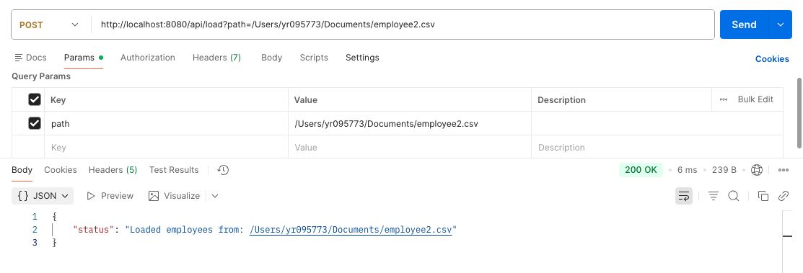
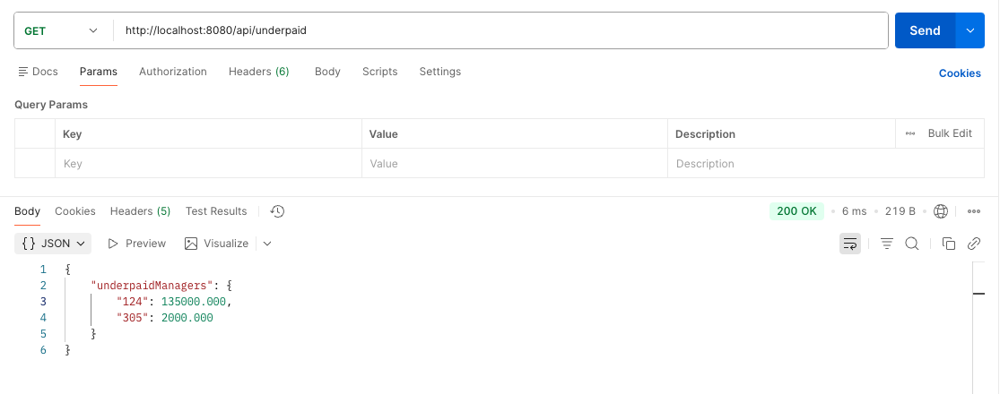
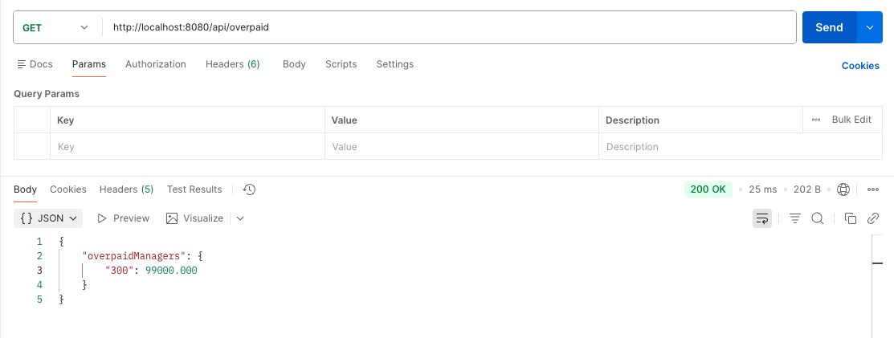
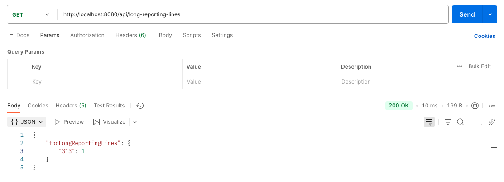

# Org Structure Analyzer

This project analyzes the organizational structure of a large company using employee information stored in a CSV file. 

It identifies:

- Underpaid managers (earning <20% above avg subordinate salary)

- Overpaid managers (earning >50% above avg subordinate salary)

- Employees with reporting lines deeper than 4 levels

The application exposes REST APIs instead of printing results to the console.

## Requirements

- Java 17

- Maven 3.6.3

- Spring Boot 3.1.4

## Notes & Assumptions

- CSV file always has valid formatting

- Salaries are numeric (BigDecimal)

- At most 1000 employees

- Reporting chain is tree-like (no circular references)

- Controller returns clean JSON responses

## Build
```
mvn clean install
```

## Run Service locally

Run Service
```
mvn spring-boot:run
```
Spring Boot will automatically:

- Start an embedded Tomcat server.

- Initialize Spring Boot beans including OrgAnalyzerController and CsvEmployeeReader.

- Expose REST APIs (POST /api/load, GET /api/underpaid, GET /api/overpaid, GET /api/long-reporting-lines).

- Load the CSV file and print the report to console when you call the POST /api/load API (either default CSV or a client-provided path).

## API Endpoints
- POST http://localhost:8080/api/load?path=<path-to-csv-file>
- GET http://localhost:8080/api/underpaid
- GET http://localhost:8080/api/overpaid
- GET http://localhost:8080/api/long-reporting-lines

## Project Structure

```
src/
 └── main/
     └── java/org/bigcompany/
         ├── controller/
         │     └── OrgAnalyzerController.java
         ├── model/
         │     └── Employee.java
         ├── service/
         │     └── OrgAnalyzerService.java  
         ├── util/
         │     └── CsvEmployeeReader.java
     └── resources/
           └── employees.csv
           └── images/...
 └── test/
       └── OrgAnalyzerServiceTest.java  
```

### Example Input

1. Default CSV - [employees.csv](https://github.com/yamininidhiraj/SwissRe-BigCompany-OrgStructureAnalyzer/blob/main/src/main/resources/employees.csv)
2. Provide path using API: 
POST http://localhost:8080/api/load?path=<path-to-csv-file>



### Example Output

1. Output printed in console
2. Output exposed through APIs 

GET http://localhost:8080/api/underpaid

GET http://localhost:8080/api/overpaid

GET http://localhost:8080/api/long-reporting-lines


