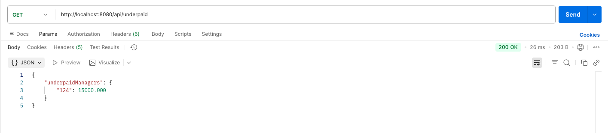
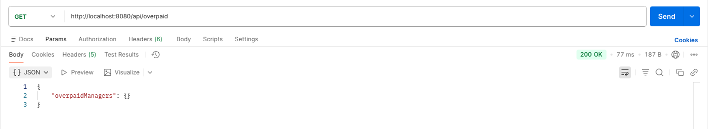
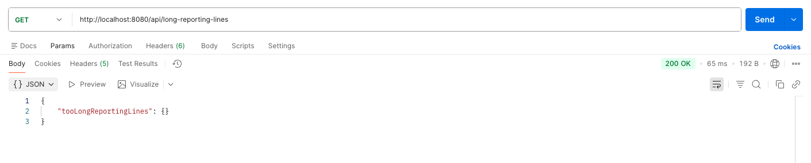

# Org Structure Analyzer

This project analyzes the organizational structure of a large company using employee information stored in a CSV file. 

It identifies:

- Underpaid managers (earning <20% above avg subordinate salary)

- Overpaid managers (earning >50% above avg subordinate salary)

- Employees with reporting lines deeper than 4 levels

The application exposes REST APIs instead of printing results to the console.

## Requirements

- Java 17

- Maven 3.6.3

- Spring Boot 3.1.4

## Notes & Assumptions

- CSV file always has valid formatting

- Salaries are numeric (BigDecimal)

- At most 1000 employees

- Reporting chain is tree-like (no circular references)

- Controller returns clean JSON responses

## Build
```
mvn clean install
```

## Run Service locally

Run Service
```
mvn spring-boot:run
```
Spring Boot will automatically:

- Start an embedded Tomcat server 

- Load the CSV file

- Initialize service + controller beans

- Expose REST APIs 

## API Endpoints

- GET http://localhost:8080/api/underpaid
- GET http://localhost:8080/api/overpaid
- GET http://localhost:8080/api/long-reporting-lines

## Project Structure

```
src/
 └── main/
     └── java/org/bigcompany/
         ├── controller/
         │     └── OrgAnalyzerController.java
         ├── model/
         │     └── Employee.java
         ├── service/
         │     └── OrgAnalyzerService.java  
         ├── util/
         │     └── CsvEmployeeReader.java
     └── resources/
           └── employees.csv
           └── images/...
 └── test/
       └── OrgAnalyzerServiceTest.java  
```

### Example CSV

| Id  | firstName | lastName | salary |  managerId |  
|-----|---|---|--------|---|
| 123 | Joe | Doe | 60000  |
| 124 | Martin | Chekov | 45000  | 123
| 125 | Bob | Ronstad | 47000  | 123
| 300 | Alice | Hasacat | 50000  | 124
| 305 | Brett | Hardleaf | 34000  | 300

### Example Output

GET http://localhost:8080/api/underpaid

GET http://localhost:8080/api/overpaid

GET http://localhost:8080/api/long-reporting-lines


